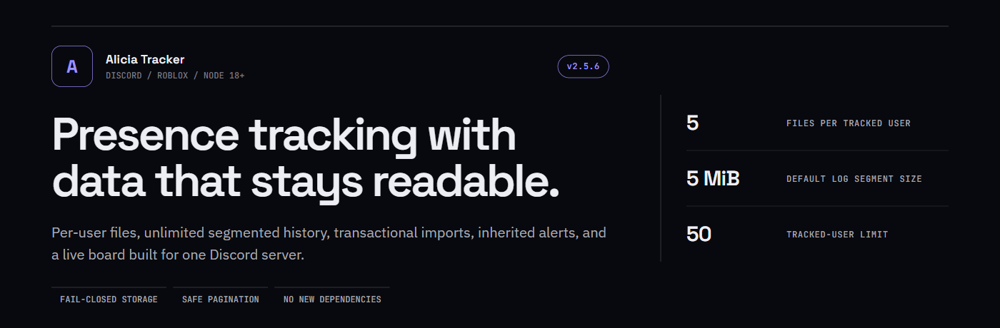
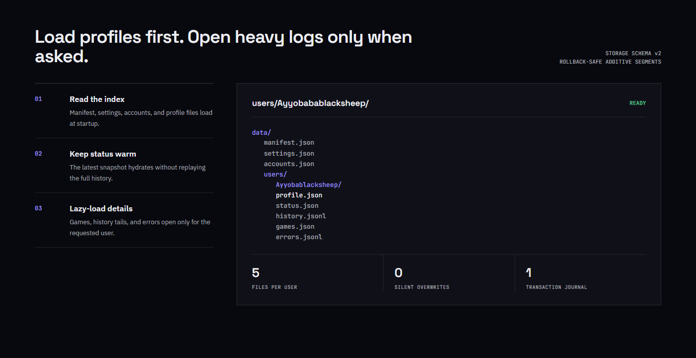

<p align="center">
  
</p>

<p align="center">
  <strong>Discord-first Roblox presence tracking with isolated user storage, unlimited segmented history, crash-safe imports, alert inheritance, and filtered live boards.</strong>
</p>

<p align="center">
  <code>Node.js 18+</code> · <code>discord.js 14</code> · <code>No database required</code>
</p>

## Highlights

- Single-server Discord architecture with guild-scoped slash commands.
- Private per-user folders for profile, status, history, games, and errors.
- Unlimited history and error logs stored in rotating JSONL segments.
- Transactional full writes and imports with automatic rollback backups.
- Fail-closed handling for corrupt, incomplete, or newer storage layouts.
- Lazy per-user log loading for faster startup and lower memory use.
- Fewer unchanged status and account writes.
- O(1) active-session timing with persisted session state.
- Bounded metadata caches and retrying storage flushes.
- Unicode Roblox usernames and transactional folder renames.
- Existing export/import compatibility with stricter backup validation.

## Filtered live board

<p align="center">
  
</p>

`/board` now supports safe filters:

```text
/board view:all
/board view:ingame
/board view:online
/board view:offline
/board view:paused
/board view:issues
```

- Paused users show `paused` instead of stale presence data.
- `issues` includes unresolved users, missing snapshots, and account failures.
- Long rows are escaped, truncated safely, and split across valid Discord embeds.
- One board command performs at most one tracker poll.

## Alert inheritance

Server notification settings now work as real defaults.

```text
/settings notifications type:Game Leave enabled:false
/track alerts username:Ayyobablacksheep type:Game Leave enabled:true
/track alerts-reset username:Ayyobabablacksheep type:Game Leave
/track alerts-reset username:Ayyobabablacksheep
```

- New users start with no personal overrides.
- Explicit user values override server defaults.
- Resetting one type restores only that server default.
- Omitting the type resets every personal alert override.
- `/track info` and `/tracker inspect` show the effective value and its source.

## Storage engine

<p align="center">
  
</p>

```text
data/
  manifest.json
  settings.json
  accounts.json
  users/
    Ayyobabablacksheep/
      profile.json
      status.json
      history.jsonl
      games.json
      errors.jsonl
  backups/
  removed-users/
  .transactions/
```

### Data behavior

- Startup reads global files and user profiles first.
- Status, history, games, and errors load only when accessed.
- Limited history commands read log tails without loading every segment.
- Exports and full statistics load every segment.
- Active `history.jsonl` and `errors.jsonl` rotate at 5 MiB by default.
- Segments use timestamped names and are never deleted automatically.
- Setting `MAX_HISTORY_PER_USER` to a positive number enables an optional active-history cap.
- `LOG_SEGMENT_MAX_BYTES` controls the rotation threshold.

### Downgrade behavior

Storage schema version remains `2`, so 2.5.6 can read 2.5.5 data directly. After log rotation, downgrading to 2.5.5 shows the active tail while older segments remain stored on disk.

## Reliability

- Existing storage is never silently replaced by empty defaults.
- Missing or malformed required files stop startup instead of risking data loss.
- Future storage versions are refused with a clear compatibility error.
- Imports validate users, accounts, IDs, username uniqueness, and account references before writing.
- Every full write creates a private pre-write backup and staged transaction.
- Interrupted transactions recover on the next startup.
- Flush failures retry with bounded exponential backoff.
- Graceful shutdown flushes pending writes.
- Discord login retries transient network and rate-limit failures.
- Roblox API degradation holds last-known states instead of fabricating offline events.

## Requirements

- Node.js 18 or newer
- A Discord application with the `bot` and `applications.commands` scopes
- Permission to view the target guild, channels, and members
- Permission to send messages in configured alert channels

## Quick start

```bash
npm install
```

Create private runtime variables:

```dotenv
DISCORD_BOT_TOKEN=your-bot-token
DISCORD_GUILD_ID=your-discord-guild-id
PORT=3000
HOST=127.0.0.1
LOG_ACCESS_TOKEN=choose-a-long-random-log-token
```

Start the bot:

```bash
npm start
```

The first startup creates the v2 storage layout automatically. Legacy `state.json` and `guilds.json` migrations create backups before conversion.

## Commands

| Command | Purpose |
| --- | --- |
| `/setup` | Confirm the configured server is ready |
| `/track add` | Track a Roblox username |
| `/track list` | List tracked users and links |
| `/track pause` / `/track resume` | Pause or resume tracking |
| `/track alerts` | Set a personal alert override |
| `/track alerts-reset` | Restore server-default alerts |
| `/track usernotify` | Route one user to a dedicated channel |
| `/board` | Show the filtered live status board |
| `/together` | Group tracked users in the same server instance |
| `/topgames` | Summarize playtime from complete history |
| `/stats` | Show event and account statistics |
| `/history` | Read a user's recent history tail |
| `/cookie` | Manage Roblox cookie accounts |
| `/notify` | Configure global and user channels |
| `/tracker inspect` | Inspect detailed live state |
| `/health` | Show API and polling health |
| `/export` | Create a complete private JSON backup |
| `/import` | Validate and transactionally restore a backup |

Sensitive and mutating commands require **Manage Server**.

## Environment variables

| Variable | Default | Purpose |
| --- | --- | --- |
| `DISCORD_BOT_TOKEN` | Required | Discord bot token |
| `DISCORD_GUILD_ID` | Required | Only Discord guild the bot may serve |
| `PORT` | `3000` | Health and protected logs HTTP port |
| `HOST` | `127.0.0.1` | Health server bind address |
| `LOG_ACCESS_TOKEN` | Disabled | Required token for `/logs` |
| `MAX_TRACKERS_PER_GUILD` | `50` | Maximum tracked users |
| `MAX_ACCOUNTS_PER_GUILD` | `25` | Maximum cookie accounts |
| `MAX_HISTORY_PER_USER` | Unlimited | Optional positive history cap |
| `LOG_SEGMENT_MAX_BYTES` | `5242880` | JSONL rotation threshold |
| `STATUS_HEARTBEAT_MS` | `60000` | Unchanged status persistence interval |
| `DISCORD_WEBHOOK_TIMEOUT_MS` | `15000` | Compatibility webhook timeout |

## Deployment

`deploy.bat` uploads code only. It never uploads `.env`, `data/`, backups, cookies, or logs.

Set deployment connection variables in your private shell or environment:

```bat
set ALICIA_DEPLOY_HOST=your-host
set ALICIA_DEPLOY_USER=your-sftp-user
set ALICIA_DEPLOY_PORT=2022
set ALICIA_DEPLOY_PASSWORD=your-password
```

Verify the host key in `%USERPROFILE%\.ssh\known_hosts` before running:

```bat
deploy.bat
```

The script refuses unknown or changed SSH host keys and never disables host verification.

## Testing

```bash
npm test
```

The native test suite covers:

- Legacy migration and backup creation
- Corrupt and future-version fail-closed behavior
- Invalid import rejection
- Transaction staging and full-state replacement
- History caps without duplicate appends
- Unlimited segmented history and errors
- Remove/re-add and rename write races
- Unicode usernames
- Alert inheritance and reset persistence
- Filtered and character-safe board rendering
- Tracker state transitions and status write reduction
- Logger redaction

## Security

- `.env`, `data/`, backups, logs, and `node_modules/` are ignored by Git.
- Account cookies remain in `data/accounts.json` with restrictive file permissions.
- Error contexts redact cookie, token, password, secret, and authorization fields.
- Commands and embeds never print complete cookies.
- `/logs` returns `404` unless `LOG_ACCESS_TOKEN` is configured and matched.
- The health server binds to `127.0.0.1` by default.
- Treat `.ROBLOSECURITY` values as passwords.
- Rotate credentials immediately if they are ever exposed.

## Project structure

```text
bot/                 Discord commands and event handling
services/            Storage, tracker, Roblox API, embeds, logging
test/                Native assertion test suite
docs/images/         README visuals
server.js            HTTP health host and process lifecycle
LICENSE              MIT license
```

## License

Released under the [MIT License](LICENSE).

## Important

Alicia Tracker is intentionally locked to one configured Discord guild. If it joins another guild, it leaves automatically. Only use authentication credentials for accounts you control.
