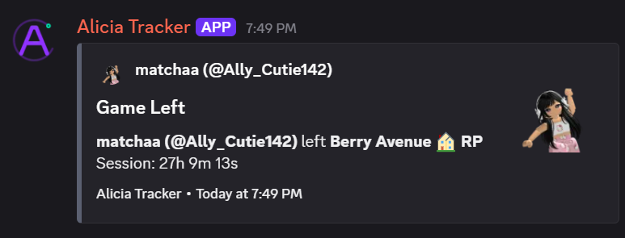
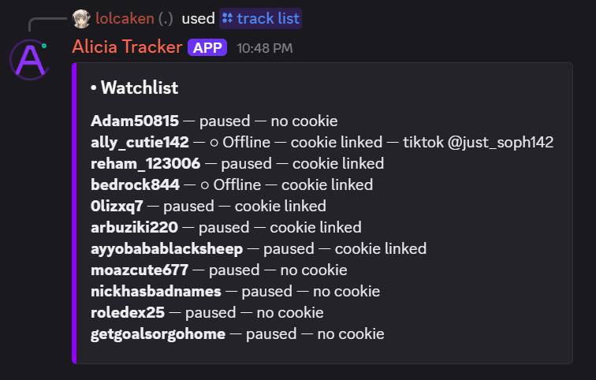
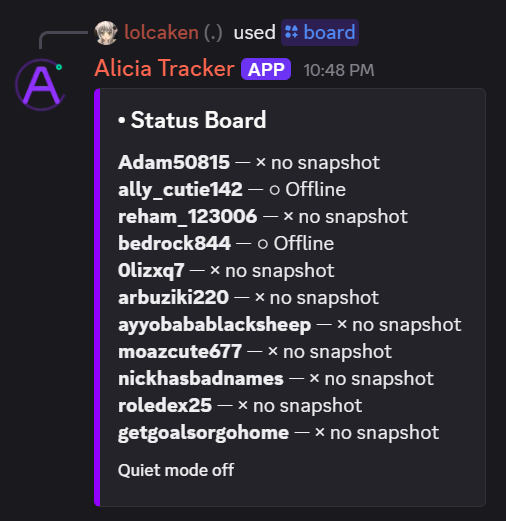

<p align="center">
  
</p>

<h1 align="center">Alicia Tracker</h1>

<p align="center">
  <strong>Track Roblox players from Discord — presence, games, sessions, alerts, and history.</strong>
</p>

<p align="center">
  <a href="#features">Features</a> ·
  <a href="#setup">Setup</a> ·
  <a href="#commands">Commands</a> ·
  <a href="#storage">Storage</a> ·
  <a href="#deployment">Deploy</a>
</p>

<p align="center">
  
</p>

## What is Alicia Tracker?

Alicia Tracker is a Discord-first Roblox presence tracker.

Add Roblox users to the tracker and Alicia watches their presence, games, and sessions, then reports changes directly to Discord.

It is designed for a single Discord server and does not require a database or web dashboard.

## The basics

| Default | Value |
| --- | ---: |
| Discord servers | 1 |
| Tracked users | 50 |
| Files per user | 5 |
| History retention | Unlimited* |

\* Unless an optional history cap is configured.

## Features

### Roblox presence tracking

Track users and see their latest state from Discord:

- Online
- In-game
- Offline
- Paused
- Problem or unresolved state

```text
/board view:all
/board view:ingame
/board view:online
/board view:offline
/board view:paused
/board view:issues
```

<p align="center">
  
</p>

### Discord alerts

Get notified when tracked users change activity.

Configure a default notification channel, then override it for individual users when needed.

```text
/notify channel
/notify test
/track usernotify
/track usernotify-clear
/track alerts
/track alerts-reset
```

<p align="center">
  
</p>

<p align="center">
  
</p>

### See who is playing together

`/together` groups tracked users who are currently in the same Roblox server instance.

```text
/together
```

```text
ExampleUser
PlayerTwo
PlayerThree

Same server instance
```

### Keep history

Alicia does not only show what is happening right now.

Each tracked user gets a readable history containing presence events, games, and errors.

```text
/history ExampleUser
/stats ExampleUser
/topgames ExampleUser
```

## Why Alicia Tracker?

### No database required

Alicia stores its data as files, keeping the system simple to deploy, inspect, back up, and move.

### Readable per-user storage

Every tracked Roblox user has an isolated directory:

```text
data/
  users/
    ExampleUser/
      profile.json
      status.json
      history.jsonl
      games.json
      errors.jsonl
```

### Built for failure

The tracker is designed around the assumption that things can go wrong.

- Writes are staged and backed up.
- Interrupted transactions recover on startup.
- Corrupt or newer storage layouts fail closed.
- Failed writes retry with bounded backoff.
- Roblox API degradation does not automatically create fake offline events.
- Removed users are archived instead of immediately destroyed.

### Fast on large histories

History is stored in segmented JSONL files.

- Logs load lazily.
- Older segments remain available.
- History files rotate at a configurable size.
- Limited history commands only read the newest required segments.
- Full exports and statistics can read the complete history.

## Setup

Complete these steps in order. Alicia Tracker is locked to one Discord guild, so create and test the bot in that server first.

### 1. Create the Discord bot

1. Open the Discord Developer Portal and create a new application.
2. Open **Bot**, add a bot, and copy its token. Resetting the token later invalidates the old value.
3. Open **OAuth2 > URL Generator** and select these scopes:
   - `bot`
   - `applications.commands`
4. Give the bot these server permissions:
   - View Channels
   - Send Messages
   - Embed Links
   - Use Application Commands
5. Open the generated invite URL and add the bot to the target server.
6. In Discord User Settings, enable **Developer Mode**. Right-click the server, choose **Copy Server ID**, and save it.

You do not need to grant Manage Server to the bot. Alicia uses that permission to restrict configuration commands to server administrators.

### 2. Prepare the project

Requirements:

| Requirement | Version |
| --- | --- |
| Node.js | 18 or newer |
| npm | Included with Node.js |
| Discord server | One configured guild |
| Roblox account | Optional, but required for full presence data |

From the project directory:

```bash
node --version
npm install
```

Confirm the first command prints Node.js 18 or newer before continuing.

### 3. Configure runtime values

Create a private `.env` file in the project root:

```dotenv
DISCORD_BOT_TOKEN=the-token-from-the-discord-bot-page
DISCORD_GUILD_ID=the-copied-server-id
PORT=3000
HOST=127.0.0.1
LOG_ACCESS_TOKEN=choose-a-long-random-token
```

Generate a log token with Node.js:

```bash
node -e "console.log(require('crypto').randomBytes(32).toString('hex'))"
```

`HOST=127.0.0.1` keeps the health server local. Set `HOST=0.0.0.0` only when your host must reach the health endpoint from outside the container.

Never commit `.env`, `data/`, backups, cookies, or logs.

### 4. Start Alicia Tracker

```bash
npm start
```

Keep the terminal running. Stop Alicia with `Ctrl+C`; the shutdown handler flushes pending storage writes.

A successful startup should show messages similar to:

```text
[alicia-tracker] health server listening on port 3000
[bot] logged in as ...
[bot] synchronized ... guild commands
[bot] ready: Server Name (...)
```

Verify the health endpoint from another local terminal:

```powershell
Invoke-RestMethod http://127.0.0.1:3000/health
```

A ready installation reports `"ready": true` and `"ok": true`.

### 5. Complete Discord setup

Run these commands in the target server:

| Order | Command | What it does |
| --- | --- | --- |
| 1 | `/setup` | Confirms the bot can access the configured guild |
| 2 | `/notify channel` | Selects the default alert channel |
| 3 | `/cookie add` | Adds a Roblox account used for presence requests |
| 4 | `/track add` | Adds a Roblox username and optionally links that account |
| 5 | `/notify test` | Sends a test alert |
| 6 | `/track list` | Confirms the user and account are linked |
| 7 | `/board` | Opens the filtered live status board |

A Roblox `.ROBLOSECURITY` cookie is a live login credential. Use an account you control, never share the cookie, and replace it through `/cookie replace` if it is exposed.

### 6. Optional per-user routing

Give one tracked user a dedicated alert channel:

```text
/track usernotify username:ExampleUser
```

Return that user to the server default:

```text
/track usernotify-clear username:ExampleUser
```

### ACLClouds or panel hosting

1. Upload the source code without `.env` or `data/`.
2. Run `npm install` once in the panel terminal.
3. Add the runtime values from Step 3 to the panel's private environment settings.
4. Set the startup command to `npm start`.
5. Start or restart the service.
6. Confirm the health endpoint and run `/health` in Discord.

Use the Deployment section later for code-only SFTP updates. Runtime data stays on the host.

### First-run checklist

- [ ] Bot token copied into `DISCORD_BOT_TOKEN`
- [ ] Correct server ID copied into `DISCORD_GUILD_ID`
- [ ] Bot invited with `bot` and `applications.commands` scopes
- [ ] Bot can view and send in the alert channel
- [ ] `npm install` completed successfully
- [ ] Startup reaches `[bot] ready`
- [ ] `/health` reports ready
- [ ] `/notify test` succeeds
- [ ] One tracked user appears in `/track list`
- [ ] `/board` renders the tracked user

### Common setup problems

| Problem | Cause | Fix |
| --- | --- | --- |
| Bot stays offline | Missing or invalid bot token | Verify `DISCORD_BOT_TOKEN` and restart |
| Configured guild is not accessible | Wrong guild ID or bot was not invited | Copy the server ID again and confirm membership |
| Slash commands do not appear | Missing OAuth scope, missing application command permission, or old command cache | Reinvite with both scopes, grant permissions, and restart the bot |
| `/notify test` cannot send | Bot lacks channel access | Grant View Channels, Send Messages, and Embed Links |
| Users show no snapshot | No Roblox account is linked | Add with `/cookie add`, then link it through `/track add` |
| Health port is already in use | Another process owns `PORT` | Change `PORT` and restart |
| `/logs` returns `404` | `LOG_ACCESS_TOKEN` is missing or wrong | Set it and send the value in the `X-Log-Token` header |
| Storage refuses to start | Existing data is malformed, incomplete, or newer | Preserve `data/`, read the error, and restore the matching backup instead of deleting files |

## Commands

### Presence

| Command | Description |
| --- | --- |
| `/track add` | Track a Roblox username |
| `/track list` | List tracked users and linked accounts |
| `/track pause` | Pause polling for a user |
| `/track resume` | Resume polling for a user |
| `/track info` | Show profile, account, channel, and effective alerts |
| `/status <username>` | Show the latest presence |
| `/board` | Show the filtered live board |
| `/together` | Group users in the same server instance |
| `/poll now` | Run an immediate tracker poll |

### Alerts

| Command | Description |
| --- | --- |
| `/notify channel` | Set the default alert channel |
| `/notify test` | Send a safe test notification |
| `/track usernotify` | Give one user a dedicated alert channel |
| `/track usernotify-clear` | Return a user to the default channel |
| `/track alerts` | Override an alert type for one user |
| `/track alerts-reset` | Restore server-default alert behavior |

### Diagnostics and data

| Command | Description |
| --- | --- |
| `/tracker inspect` | Show detailed live state |
| `/stats <username>` | Summarize events and account state |
| `/history <username>` | Show recent history |
| `/topgames <username>` | Summarize playtime |
| `/health` | Show tracker and Roblox API health |
| `/export` | Download a complete private JSON backup |
| `/import` | Validate and restore a backup transactionally |

Sensitive or mutating commands require **Manage Server**.

## Filtered live board

```text
/board view:all
/board view:ingame
/board view:online
/board view:offline
/board view:paused
/board view:issues
```

The board is designed for live use:

- `paused` users never appear as currently active from stale data.
- `issues` shows unresolved users, missing snapshots, and account failures.
- A board command performs at most one tracker poll.
- Long names and rows are escaped and split across valid Discord embeds.

## Alert inheritance

Server settings act as defaults.

A user only stores an alert override when one is intentionally configured.

```text
/settings notifications type:Game Leave enabled:false
```

```text
/track alerts \
  username:ExampleUser \
  type:Game Leave \
  enabled:true
```

Resetting the override returns the user to the server default:

```text
/track alerts-reset username:ExampleUser type:Game Leave
```

Or reset every personal override:

```text
/track alerts-reset username:ExampleUser
```

`/track info` and `/tracker inspect` show both the effective value and where it came from.

## Storage

Alicia keeps global configuration separate from individual user data:

```text
data/
  manifest.json
  settings.json
  accounts.json

  users/
    ExampleUser/
      profile.json
      status.json
      history.jsonl
      games.json
      errors.jsonl

  backups/
  removed-users/
  .transactions/
```

### Lazy loading

Startup loads:

- `manifest.json`
- `settings.json`
- `accounts.json`
- User profiles

Status, history, games, and errors are loaded only when required.

### Segmented logs

Active logs use:

- `history.jsonl`
- `errors.jsonl`

At the default 5 MiB threshold, logs rotate into timestamped segments.

Segments are never automatically deleted.

Configure rotation with:

```dotenv
LOG_SEGMENT_MAX_BYTES=5242880
```

An optional positive `MAX_HISTORY_PER_USER` can limit retained history.

### Failure protection

Alicia refuses to silently replace damaged data.

- Missing storage layouts stop startup.
- Malformed data stops startup.
- Newer unsupported schemas stop startup.
- Imports are validated before existing data is modified.
- Full writes create backups and staged transactions.
- Interrupted transactions recover on the next startup.
- Failed flushes retry with bounded exponential backoff.
- Removed users are archived under `removed-users/`.

## Reliability

Alicia is designed to avoid turning temporary failures into incorrect history.

- Discord login retries network failures and rate limits.
- Roblox API degradation preserves last-known state.
- Poll failures use bounded backoff.
- Temporary API failures do not create mass false offline transitions.
- Tracker metadata caches are pruned.
- Session timing does not scan complete history.
- Graceful shutdown flushes pending writes.
- The health endpoint reports readiness, poll state, API health, and failure counts.

## Configuration

| Variable | Default | Purpose |
| --- | --- | --- |
| `DISCORD_BOT_TOKEN` | Required | Discord bot token |
| `DISCORD_GUILD_ID` | Required | Guild the bot serves |
| `PORT` | `3000` | Health/log HTTP port |
| `HOST` | `127.0.0.1` | HTTP server bind address |
| `LOG_ACCESS_TOKEN` | Disabled | Token required for `/logs` |
| `MAX_TRACKERS_PER_GUILD` | `50` | Maximum tracked users |
| `MAX_ACCOUNTS_PER_GUILD` | `25` | Maximum account connections |
| `MAX_HISTORY_PER_USER` | Unlimited | Optional history cap |
| `LOG_SEGMENT_MAX_BYTES` | `5242880` | JSONL rotation threshold |
| `STATUS_HEARTBEAT_MS` | `60000` | Unchanged status persistence interval |
| `DISCORD_WEBHOOK_TIMEOUT_MS` | `15000` | Webhook timeout |

## Deployment

`deploy.bat` uploads code only.

It never uploads:

- `.env`
- `data/`
- `backups/`
- Cookies
- Logs

Configure private deployment variables:

```bat
set ALICIA_DEPLOY_HOST=your-host
set ALICIA_DEPLOY_USER=your-sftp-user
set ALICIA_DEPLOY_PORT=2022
set ALICIA_DEPLOY_PASSWORD=your-password
```

Verify the SSH host key in:

```text
%USERPROFILE%\.ssh\known_hosts
```

Then run:

```bat
deploy.bat
```

The deployment script refuses unknown or changed SSH host keys.

## Testing

```bash
npm test
```

The test suite covers:

- Migrations
- Corruption refusal
- Transactional imports
- Segmented history
- Remove/re-add races
- Rename races
- Unicode usernames
- Alert inheritance
- Board filtering
- Status write reduction
- Logger redaction

## Security

Treat `.ROBLOSECURITY` values as passwords.

Alicia:

- Stores account cookies separately
- Uses restrictive storage permissions where supported
- Redacts cookie, token, password, secret, and authorization fields
- Never prints complete cookies in commands or embeds
- Keeps `/logs` disabled unless `LOG_ACCESS_TOKEN` is configured
- Binds the health server to `127.0.0.1` by default
- Allows credentials to be replaced after exposure

Never commit credentials, cookies, `.env`, or private data to Git.

## Project structure

```text
bot/                 Discord commands and event handling
services/            Storage, tracker, Roblox API, embeds, logging
test/                Native assertion test suite
docs/images/         README screenshots and logo
server.js            HTTP health host and process lifecycle
LICENSE              MIT license
```

## License

Released under the [MIT License](LICENSE).

Alicia Tracker is intentionally locked to one configured Discord guild. If it joins another guild, it leaves automatically.
