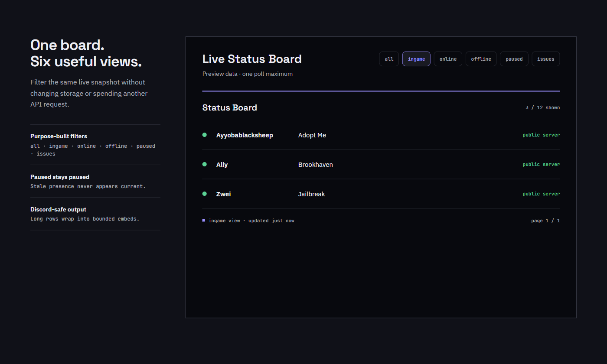
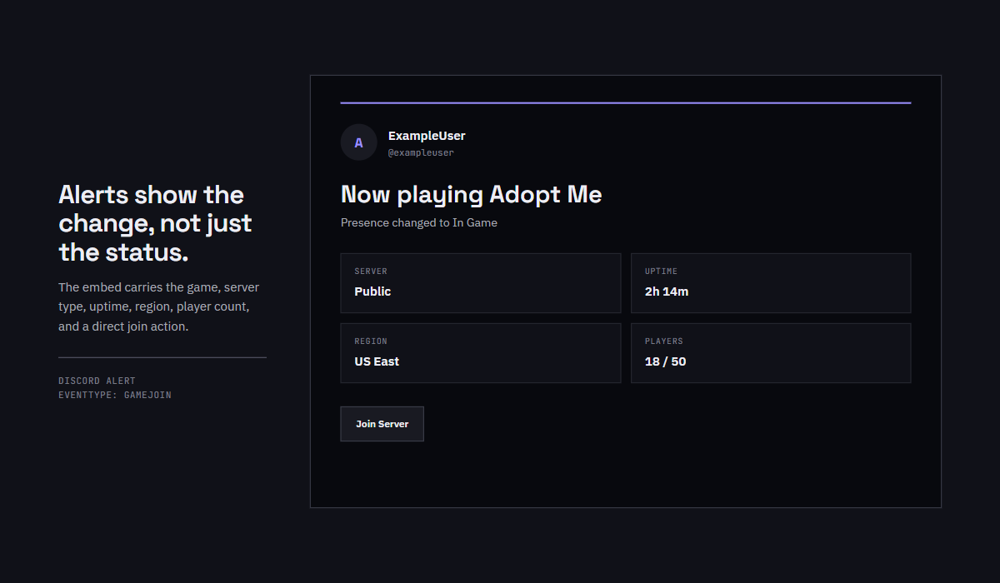
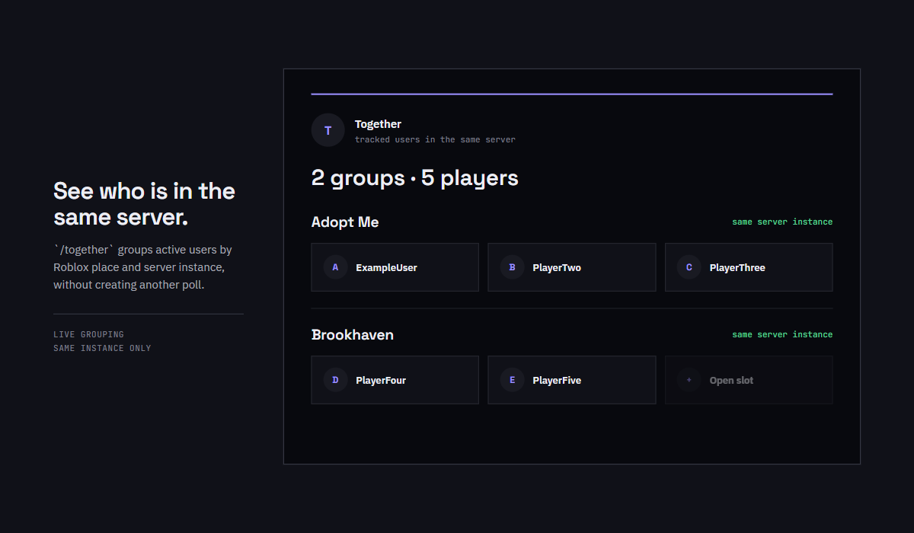
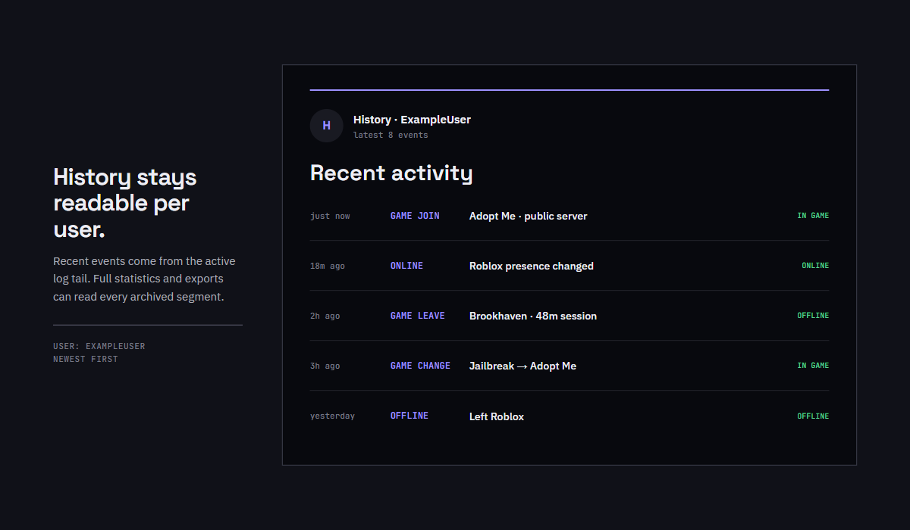

<p align="center">
  
</p>

<h1 align="center">Alicia Tracker</h1>

<p align="center">
  <strong>Track Roblox players from Discord — presence, games, sessions, alerts, and history.</strong>
</p>

<p align="center">
  <a href="#features">Features</a> ·
  <a href="#quick-start">Quick start</a> ·
  <a href="#commands">Commands</a> ·
  <a href="#storage">Storage</a> ·
  <a href="#deployment">Deploy</a>
</p>

<p align="center">
  
</p>

## What is Alicia Tracker?

Alicia Tracker is a Discord-first Roblox presence tracker.

Add Roblox users to the tracker and Alicia watches their presence, games, and sessions, then reports changes directly to Discord.

It is designed for a single Discord server and does not require a database or web dashboard.

## The basics

| Default | Value |
| --- | ---: |
| Discord servers | 1 |
| Tracked users | 50 |
| Files per user | 5 |
| History retention | Unlimited* |

\* Unless an optional history cap is configured.

## Features

### 👤 Roblox presence tracking

Track users and see their latest state from Discord:

- 🟢 Online
- 🎮 In-game
- ⚫ Offline
- ⏸️ Paused
- ⚠️ Problem or unresolved state

```text
/board view:all
/board view:ingame
/board view:online
/board view:offline
/board view:paused
/board view:issues
```

<p align="center">
  
</p>

### 🔔 Discord alerts

Get notified when tracked users change activity.

Configure a default notification channel, then override it for individual users when needed.

```text
/notify channel
/notify test
/track usernotify
/track usernotify-clear
/track alerts
/track alerts-reset
```

<p align="center">
  
</p>

### 👥 See who is playing together

`/together` groups tracked users who are currently in the same Roblox server instance.

```text
/together
```

```text
ExampleUser
PlayerTwo
PlayerThree

↳ Same server instance
```

<p align="center">
  
</p>

### 📊 Keep history

Alicia does not only show what is happening right now.

Each tracked user gets a readable history containing presence events, games, and errors.

```text
/history ExampleUser
/stats ExampleUser
/topgames ExampleUser
```

<p align="center">
  
</p>

## Why Alicia Tracker?

### No database required

Alicia stores its data as files, keeping the system simple to deploy, inspect, back up, and move.

### Readable per-user storage

Every tracked Roblox user has an isolated directory:

```text
data/
  users/
    ExampleUser/
      profile.json
      status.json
      history.jsonl
      games.json
      errors.jsonl
```

### Built for failure

The tracker is designed around the assumption that things can go wrong.

- Writes are staged and backed up.
- Interrupted transactions recover on startup.
- Corrupt or newer storage layouts fail closed.
- Failed writes retry with bounded backoff.
- Roblox API degradation does not automatically create fake offline events.
- Removed users are archived instead of immediately destroyed.

### Fast on large histories

History is stored in segmented JSONL files.

- Logs load lazily.
- Older segments remain available.
- History files rotate at a configurable size.
- Limited history commands only read the newest required segments.
- Full exports and statistics can read the complete history.

## Quick start

### Requirements

- Node.js 18 or newer
- A Discord application
- A Discord bot with:
  - `bot`
  - `applications.commands`
- Access to the target Discord server

### 1. Install

```bash
npm install
```

### 2. Configure

Create a private `.env` file:

```dotenv
DISCORD_BOT_TOKEN=your-bot-token
DISCORD_GUILD_ID=your-discord-guild-id
PORT=3000
HOST=127.0.0.1
LOG_ACCESS_TOKEN=choose-a-long-random-log-token
```

Never commit:

- `.env`
- `data/`
- `backups/`
- Cookies
- Logs

### 3. Start

```bash
npm start
```

The first startup creates the storage layout automatically.

Legacy `state.json` and `guilds.json` migrations create a backup before conversion.

### 4. Configure Discord

Run:

```text
/setup
/notify channel
/cookie add
/track add
```

The bot is locked to the configured Discord guild. If it is added to another guild, it leaves automatically.

## Commands

### Presence

| Command | Description |
| --- | --- |
| `/track add` | Track a Roblox username |
| `/track list` | List tracked users and linked accounts |
| `/track pause` | Pause polling for a user |
| `/track resume` | Resume polling for a user |
| `/track info` | Show profile, account, channel, and effective alerts |
| `/status <username>` | Show the latest presence |
| `/board` | Show the filtered live board |
| `/together` | Group users in the same server instance |
| `/poll now` | Run an immediate tracker poll |

### Alerts

| Command | Description |
| --- | --- |
| `/notify channel` | Set the default alert channel |
| `/notify test` | Send a safe test notification |
| `/track usernotify` | Give one user a dedicated alert channel |
| `/track usernotify-clear` | Return a user to the default channel |
| `/track alerts` | Override an alert type for one user |
| `/track alerts-reset` | Restore server-default alert behavior |

### Diagnostics and data

| Command | Description |
| --- | --- |
| `/tracker inspect` | Show detailed live state |
| `/stats <username>` | Summarize events and account state |
| `/history <username>` | Show recent history |
| `/topgames <username>` | Summarize playtime |
| `/health` | Show tracker and Roblox API health |
| `/export` | Download a complete private JSON backup |
| `/import` | Validate and restore a backup transactionally |

Sensitive or mutating commands require **Manage Server**.

## Filtered live board

```text
/board view:all
/board view:ingame
/board view:online
/board view:offline
/board view:paused
/board view:issues
```

The board is designed for live use:

- `paused` users never appear as currently active from stale data.
- `issues` shows unresolved users, missing snapshots, and account failures.
- A board command performs at most one tracker poll.
- Long names and rows are escaped and split across valid Discord embeds.

## Alert inheritance

Server settings act as defaults.

A user only stores an alert override when one is intentionally configured.

```text
/settings notifications type:Game Leave enabled:false
```

```text
/track alerts \
  username:ExampleUser \
  type:Game Leave \
  enabled:true
```

Resetting the override returns the user to the server default:

```text
/track alerts-reset username:ExampleUser type:Game Leave
```

Or reset every personal override:

```text
/track alerts-reset username:ExampleUser
```

`/track info` and `/tracker inspect` show both the effective value and where it came from.

## Storage

Alicia keeps global configuration separate from individual user data:

```text
data/
  manifest.json
  settings.json
  accounts.json

  users/
    ExampleUser/
      profile.json
      status.json
      history.jsonl
      games.json
      errors.jsonl

  backups/
  removed-users/
  .transactions/
```

### Lazy loading

Startup loads:

- `manifest.json`
- `settings.json`
- `accounts.json`
- User profiles

Status, history, games, and errors are loaded only when required.

### Segmented logs

Active logs use:

- `history.jsonl`
- `errors.jsonl`

At the default 5 MiB threshold, logs rotate into timestamped segments.

Segments are never automatically deleted.

Configure rotation with:

```dotenv
LOG_SEGMENT_MAX_BYTES=5242880
```

An optional positive `MAX_HISTORY_PER_USER` can limit retained history.

### Failure protection

Alicia refuses to silently replace damaged data.

- Missing storage layouts stop startup.
- Malformed data stops startup.
- Newer unsupported schemas stop startup.
- Imports are validated before existing data is modified.
- Full writes create backups and staged transactions.
- Interrupted transactions recover on the next startup.
- Failed flushes retry with bounded exponential backoff.
- Removed users are archived under `removed-users/`.

## Reliability

Alicia is designed to avoid turning temporary failures into incorrect history.

- Discord login retries network failures and rate limits.
- Roblox API degradation preserves last-known state.
- Poll failures use bounded backoff.
- Temporary API failures do not create mass false offline transitions.
- Tracker metadata caches are pruned.
- Session timing does not scan complete history.
- Graceful shutdown flushes pending writes.
- The health endpoint reports readiness, poll state, API health, and failure counts.

## Configuration

| Variable | Default | Purpose |
| --- | --- | --- |
| `DISCORD_BOT_TOKEN` | Required | Discord bot token |
| `DISCORD_GUILD_ID` | Required | Guild the bot serves |
| `PORT` | `3000` | Health/log HTTP port |
| `HOST` | `127.0.0.1` | HTTP server bind address |
| `LOG_ACCESS_TOKEN` | Disabled | Token required for `/logs` |
| `MAX_TRACKERS_PER_GUILD` | `50` | Maximum tracked users |
| `MAX_ACCOUNTS_PER_GUILD` | `25` | Maximum account connections |
| `MAX_HISTORY_PER_USER` | Unlimited | Optional history cap |
| `LOG_SEGMENT_MAX_BYTES` | `5242880` | JSONL rotation threshold |
| `STATUS_HEARTBEAT_MS` | `60000` | Unchanged status persistence interval |
| `DISCORD_WEBHOOK_TIMEOUT_MS` | `15000` | Webhook timeout |

## Deployment

`deploy.bat` uploads code only.

It never uploads:

- `.env`
- `data/`
- `backups/`
- Cookies
- Logs

Configure private deployment variables:

```bat
set ALICIA_DEPLOY_HOST=your-host
set ALICIA_DEPLOY_USER=your-sftp-user
set ALICIA_DEPLOY_PORT=2022
set ALICIA_DEPLOY_PASSWORD=your-password
```

Verify the SSH host key in:

```text
%USERPROFILE%\.ssh\known_hosts
```

Then run:

```bat
deploy.bat
```

The deployment script refuses unknown or changed SSH host keys.

## Testing

```bash
npm test
```

The test suite covers:

- Migrations
- Corruption refusal
- Transactional imports
- Segmented history
- Remove/re-add races
- Rename races
- Unicode usernames
- Alert inheritance
- Board filtering
- Status write reduction
- Logger redaction

## Security

Treat `.ROBLOSECURITY` values as passwords.

Alicia:

- Stores account cookies separately
- Uses restrictive storage permissions where supported
- Redacts cookie, token, password, secret, and authorization fields
- Never prints complete cookies in commands or embeds
- Keeps `/logs` disabled unless `LOG_ACCESS_TOKEN` is configured
- Binds the health server to `127.0.0.1` by default
- Allows credentials to be replaced after exposure

Never commit credentials, cookies, `.env`, or private data to Git.

## Project structure

```text
bot/                 Discord commands and event handling
services/            Storage, tracker, Roblox API, embeds, logging
test/                Native assertion test suite
docs/images/         README screenshots and logo
server.js            HTTP health host and process lifecycle
LICENSE              MIT license
```

## License

Released under the [MIT License](LICENSE).

Alicia Tracker is intentionally locked to one configured Discord guild. If it joins another guild, it leaves automatically.
